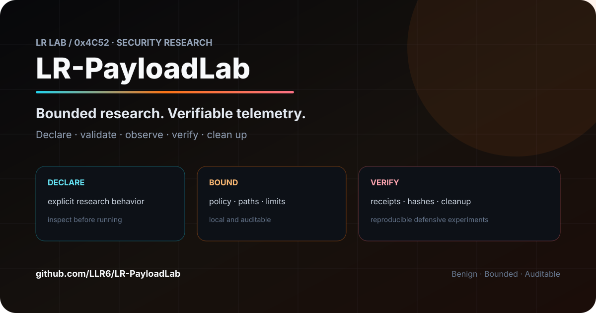
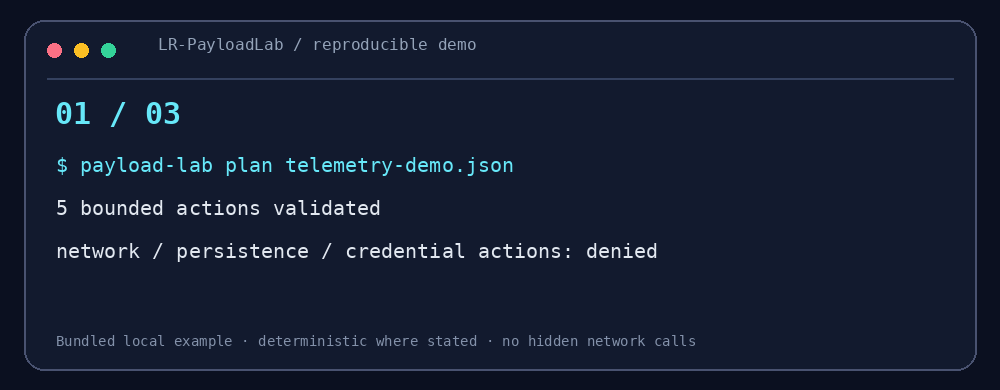

# LR-PayloadLab

<!-- LR-LAB-CHROME:START -->
<p align="center">
  <a href="https://github.com/LLR6"></a>
  
</p>
<p align="center"><strong>Bounded payloads. Verifiable research.</strong><br><sub>Auditable benign endpoint telemetry scenarios</sub></p>
<p align="center"><a href="https://github.com/LLR6/LR-PayloadLab/stargazers"></a>
   </p>
<p align="center"><a href="https://github.com/LLR6">Profile</a> · <a href="https://github.com/LLR6?tab=repositories">All projects</a> · <a href="https://github.com/LLR6/LR-PayloadLab/issues">Issues</a></p>
<!-- LR-LAB-CHROME:END -->

<!-- LR-PROJECT-DOCS:START -->
### Project docs
[Architecture](./docs/ARCHITECTURE.md) · [Benchmarks](./docs/BENCHMARKS.md) · [Threat model](./docs/THREAT_MODEL.md) · [Roadmap](./docs/ROADMAP.md) · [Compatibility](./docs/COMPATIBILITY.md) · [Releasing](./docs/RELEASING.md) · [Security](./SECURITY.md) · [Support](./SUPPORT.md)
 · [Change risk](./docs/CHANGE_RISK.md) · [Failure modes](./docs/FAILURE_MODES.md) · [Migrations](./docs/MIGRATIONS.md)
<!-- LR-PROJECT-DOCS:END -->
<p align="center">[Threat model](docs/THREAT_MODEL.md)</p>


<p align="center"></p>
<p align="center"></p>
<p align="center"><strong>Bounded payloads. Verifiable research.</strong></p>
<p align="center">Auditable endpoint telemetry scenarios with receipts and rollback.</p>
<p align="center">   </p>

## 30 秒看懂

用 JSON 描述研究行为，平台先检查动作白名单、路径边界和资源上限，再执行并生成逐动作回执。`rollback` 根据回执清理实验文件。

```text
Manifest → Policy validation → Bounded execution → Receipt → Rollback
```

## 5 分钟 Demo

```bash
python -m pip install -e .
payload-lab plan examples/telemetry-demo.json
payload-lab run examples/telemetry-demo.json --receipt receipt.json
payload-lab rollback receipt.json
payload-lab build examples/telemetry-demo.json --output generated-payload.py
```

示例只包含临时标记、无害子进程、文件哈希、50ms 计算与延迟。生成文件的 SHA-256 会写入输出，便于实验复现。

## 研究价值

- **可审计载荷**：行为在 Manifest 中完整列出，生成脚本不隐藏动作。
- **遥测验证**：可观察文件、进程、计算和时间行为是否被采集。
- **安全约束**：拒绝未知动作、目录逃逸、长时间计算；无网络、持久化、凭据访问与规避模块。
- **回滚回执**：实验产生的文件记录在回执中，按工作区边界清理。

## 研究路线

下一步计划加入跨平台遥测适配器、Sigma 规则回放、实验签名、容器隔离和检测覆盖矩阵。欢迎提交新的**无害、可回滚、可观测**场景。

作者：LLR6 · MIT License

<!-- LR-CONTENT-UPGRADE-2:START -->
## v0.2：实验内容也要有“指纹”

`plan` 和 `run` 生成的 receipt 现在包含：

```json
{
  "schema": "lr-payload-receipt/v2",
  "manifest_sha256": "..."
}
```

这个 SHA-256 来自**排序后的 canonical JSON Manifest**，因此键顺序变化不会改变实验指纹。

用途不是“证明实验绝对可信”，而是回答一个更基础的问题：

> 这份 receipt 到底对应哪一份行为声明？

`build` 也会同时输出生成文件 SHA-256 与 Manifest SHA-256，方便把“输入实验定义”和“生成产物”放在同一条复现链里。

这让实验记录从：

```text
我运行过这个场景
```

变成：

```text
Manifest digest
      ↓
bounded execution
      ↓
receipt
      ↓
generated artifact digest
```

<!-- LR-CONTENT-UPGRADE-2:END -->

<!-- LR-DEEP-CONTENT-2:START -->
### Manifest inspection

在真正执行 `plan/run` 之前，可以先静态查看 Manifest：

```bash
payload-lab inspect examples/telemetry-demo.json
```

输出会明确给出：

- Manifest SHA-256；
- action 数量与类型；
- 会访问的相对工作区路径；
- 声明的最大 sleep / CPU burst 时间；
- 当前允许动作集合；
- `network=false`；
- `arbitrary_command_execution=false`；
- `workspace_escape=false`。

这份 inspection 现在也由 CI 自动生成并作为 artifact 保存。
<!-- LR-DEEP-CONTENT-2:END -->

<!-- LR-ENGINEERING-REF:START -->
## Engineering Reference

[Architecture](docs/ARCHITECTURE.md) · [Security](SECURITY.md) · [Contributing](CONTRIBUTING.md) · [Changelog](CHANGELOG.md) · [Release checklist](docs/RELEASE_CHECKLIST.md) · [Receipt schema](schemas/receipt.schema.json) · [Inspection schema](schemas/inspection.schema.json)

These files document the project's architecture, safety boundaries, reproducibility assumptions and release process.
<!-- LR-ENGINEERING-REF:END -->

<!-- LR-LAB-FOOTER:START -->
---
<p align="center"><sub>Part of <a href="https://github.com/LLR6">LR Lab</a> · Security × AI × Android × Automation</sub><br><sub>Build things that are useful, inspectable, and reproducible.</sub></p>
<!-- LR-LAB-FOOTER:END -->

